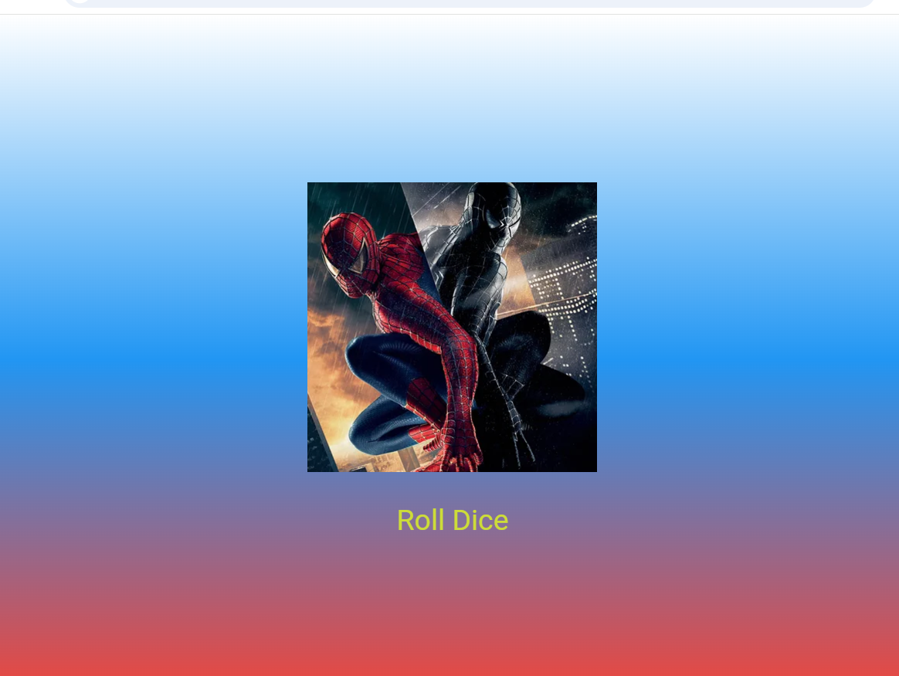

# Лабораторная работа №4-5. 

**ФИО:** Перехрест Александра Петровна
**Группа:** исп-242
**Дата сдачи:** 04.10.2026

## Что изучили

1. Структура UI во Flutter и компонентный подход
2. Создание StatelessWidget и StatefulWidget
3. Работа с assets (ресурсами приложения)
4. Управление состоянием через setState()
5. Генерация случайных чисел через Random

## Скриншот финального приложения



## Ссылка на репозиторий

https://github.com/Alexandraa19/Flutter_Widgets.git

## Инструкция по запуску

```bash
flutter pub get
flutter run -d chrome
```

## Ответы на вопросы

### 1. Зачем выносить виджеты в отдельные файлы? Что изменится если держать всё в main.dart?

Вынос виджетов в отдельные файлы улучшает читаемость, упрощает поиск нужного кода, позволяет переиспользовать виджеты и облегчает командную работу. Если держать всё в main.dart - файл быстро разрастается, ориентироваться в нём сложно, а переиспользовать код почти невозможно.

### 2. Что такое BuildContext? Почему метод build() принимает его как параметр?

BuildContext -объект с информацией о положении виджета в дереве виджетов. Flutter передаёт его автоматически при каждой перерисовке. Нужен, чтобы виджет мог взаимодействовать с другими виджетами дерева (тема, размеры, поиск родителя).

### 3. Чем StatelessWidget отличается от StatefulWidget?

StatelessWidget - виджет без состояния, отрисовывается один раз и не меняется. StatefulWidget - виджет с состоянием в объекте State, которое меняется через setState(), вызывая перерисовку. Пример StatelessWidget: статичный текст, логотип. Пример StatefulWidget: счётчик, форма ввода, игра с кубиком.

### 4. Почему Random() создаётся на уровне файла, а не внутри rollDice()?

Создание Random внутри функции при каждом нажатии кнопки создаёт новый генератор, что менее эффективно. Один объект Random на уровне файла переиспользуется.